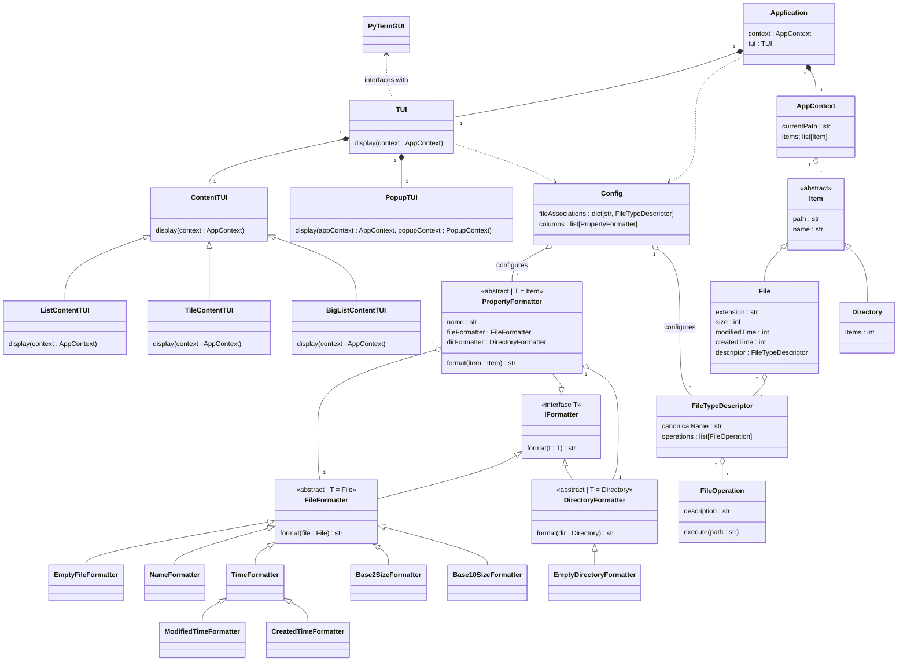

```mermaid
classDiagram
	direction TB
	class Config {
		fileAssociations : dict[str, FileTypeDescriptor]
		columns : list[PropertyFormatter]
	}
	class Application {
		context : AppContext
		tui : TUI
	}
	class AppContext {
		currentPath : str
		items: list[Item]
	}
	class TUI {
		display(context : AppContext)
	}
	class PopupTUI {
		display(appContext : AppContext, popupContext : PopupContext)
	}
	class ContentTUI {
		display(context : AppContext)
	}
	class ListContentTUI {
		display(context : AppContext)
	}
	
	class TileContentTUI {
		display(context : AppContext)
	}
	
	class BigListContentTUI {
		display(context : AppContext)
	}
	class Item {
		<<abstract>>
		path : str
		name : str
	}
	class File {		
		extension : str
		size : int
		modifiedTime : int
		createdTime : int
		descriptor : FileTypeDescriptor
	}
	
	class Directory {
		items : int
	}
	class IFormatter {
		 <<interface T>>
		 format(t : T) str
	}
	class FileFormatter {
		<<abstract | T = File>>
		format(file : File) str
	}
	class DirectoryFormatter {
		<<abstract | T = Directory>>
		format(dir : Directory) str
	}
	class PropertyFormatter {
		<<abstract | T = Item>>
		name : str
		fileFormatter : FileFormatter
		dirFormatter : DirectoryFormatter
		format(item : Item) str
	}
	class FileTypeDescriptor {
		canonicalName : str
		operations : list[FileOperation]
	}
	class FileOperation {
		description : str
		execute(path : str)
	}


	Application "1" *-- "1" TUI
	PyTermGUI <.. TUI : interfaces with
	TUI "1" *-- "1" ContentTUI
	ContentTUI <|-- ListContentTUI
	ContentTUI <|-- TileContentTUI
	ContentTUI <|-- BigListContentTUI
	TUI "1" *-- "1" PopupTUI

	Config "1" o-- "*" PropertyFormatter : configures
	Config "1" o-- "*" FileTypeDescriptor : configures
	TUI ..> Config
	Application ..> Config
	Application "1" *-- "1" AppContext
	
	AppContext "1" o-- "*" Item
	Item <|-- File
	Item <|-- Directory

	PropertyFormatter "1" o-- "1" FileFormatter
	IFormatter <|-- FileFormatter
	IFormatter <|-- DirectoryFormatter
	PropertyFormatter --|> IFormatter
	PropertyFormatter "1" o-- "1" DirectoryFormatter
	


	FileFormatter <|-- EmptyFileFormatter
	
	FileFormatter <|-- NameFormatter
	FileFormatter <|-- TimeFormatter	
	TimeFormatter <|-- ModifiedTimeFormatter
	FileFormatter <|-- Base2SizeFormatter
	FileFormatter <|-- Base10SizeFormatter	
	TimeFormatter <|-- CreatedTimeFormatter

	DirectoryFormatter <|-- EmptyDirectoryFormatter
	
	FileTypeDescriptor "*" o-- "*" FileOperation
	File "*" o-- "1" FileTypeDescriptor
	
```

