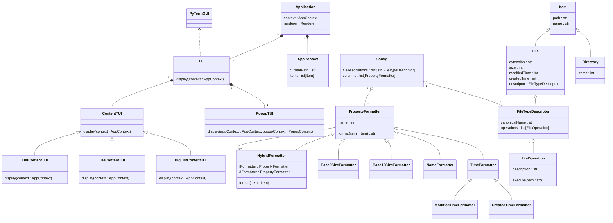

```mermaid
classDiagram
	class Config {
		fileAssociations : dict[str, FileTypeDescriptor]
		columns : list[PropertyFormatter]
	}
	class Application {
		context : AppContext
		renderer : Renderer
		
	}
	
	class AppContext {
		currentPath : str
		items: list[Item]
	}
	Application "1" *-- "1" AppContext
	Application "1" *-- "1" TUI
	
	class TUI {
		display(context : AppContext)
	}
	TUI "1" *-- "1" ContentTUI
	TUI "1" *-- "1" PopupTUI
	class PopupTUI {
		display(appContext : AppContext, popupContext : PopupContext)
	}
	class ContentTUI {
		display(context : AppContext)
	}
	class ListContentTUI {
		display(context : AppContext)
	}
	
	class TileContentTUI {
		display(context : AppContext)
	}
	
	class BigListContentTUI {
		display(context : AppContext)
	}
	
	ContentTUI <|-- ListContentTUI
	ContentTUI <|-- TileContentTUI
	ContentTUI <|-- BigListContentTUI
	PyTermGUI <.. TUI

	class PropertyFormatter {
		name : str
		format(item : Item) str
	}
	
	class HybridFormatter {
		fFormatter : PropertyFormatter
		dFormatter : PropertyFormatter
		format(item : Item) 
	}
	
	Config "1" o-- "*" PropertyFormatter
	PropertyFormatter <|-- Base2SizeFormatter
	PropertyFormatter <|-- Base10SizeFormatter
	PropertyFormatter <|-- NameFormatter
	PropertyFormatter <|-- TimeFormatter
	PropertyFormatter <|-- HybridFormatter
	HybridFormatter o-- PropertyFormatter
	
	TimeFormatter <|-- ModifiedTimeFormatter
	TimeFormatter <|-- CreatedTimeFormatter

	class Item {
		path : str
		name : str
	}
	class File {
		extension : str
		size : int
		modifiedTime : int
		createdTime : int
		descriptor : FileTypeDescriptor
	}
	
	class Directory {
		items : int
	}
	
	class FileTypeDescriptor {
		canonicalName : str
		operations : list[FileOperation]
	}
	
	class FileOperation {
		description : str
		execute(path : str)
	}
	
	FileTypeDescriptor "*" o-- "*" FileOperation
	File "*" o-- "1" FileTypeDescriptor
	Config "1" o-- "*" FileTypeDescriptor
	
	Item <|-- File
	Item <|-- Directory
```

